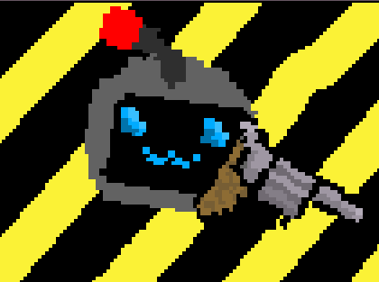

<div align="center">



# AntiVirus


A wave based twin stick shooter roguelike built in Python with pygame. Fight off waves of increasingly dangerous bugs, collect fragments, and buy really super cool upgrades.


</div>

---

## Gameplay

Survive endless waves of enemies that escalate in difficulty as rounds progress. Between waves a shop opens where you can spend collected fragments on passive upgrades and active abilities that stack and interact with each other in interesting ways.

### Controls

| Action | Keyboard | Controller |
|---|---|---|
| Move | WASD | Left stick |
| Aim | Mouse | Right stick |
| Shoot | Left click | Right trigger |
| Active 1 / 2 / 3 | Space / Q / E | A / B / Y |
| Pause | Escape | Start |

---

## Features

### Entity and Scene System
A custom entity/scene architecture manages all game objects through a draw-priority layer system, deferred add/remove queues to avoid mid-iteration mutation, and deep-copy scene reset on scene switch so returning to a scene always restores its initial state.

### Enemy Roster
Ten enemy types with distinct behaviours alongside two minibosses, spawned via a weighted rarity system that scales with wave number and time elapsed. Enemies include:
- **Fly / Baby Fly** - direct pursuit
- **Cockroach / Baby Cockroach** - erratic movement and skittish
- **Termites** - swarms and patrols arena, 'boids' like behaviour
- **Ant** - circles and entraps player
- **Fire Ant** - circles and fires flaming projectiles at player
- **Mosquito** - ranged attacker that keeps distance and fires at the player
- **Snail / MagneticSnail** - alternates between a vulnerable moving phase and an invulnerable stationary phase that reflects bullets. Magnetic variant attracts player and bullets
- **Machinegun-quito** - burst-fire ranged attacker, vulnerable when reloading
- **Mother Cockroach** - miniboss that slowly encroaches upon player and explodes into baby Cockroaches upon death
- **Mother Fly** - miniboss that spawns Mosquitos and Flys

### Upgrade System
Cards are split into passive upgrades and active abilities across common, rare, and legendary rarities. Passives apply permanent stat changes or alter gameplay permanently on pickup (damage, fire rate, bullet count, homing, lifesteal, piercing, etc.). Actives are slotted abilities with cooldowns which you are allowed 3 of (AOE blast, slow web, EMP stun, overclock, repulse, time slowdown). All cards stack and interact in interesting ways - e.g. Shotgun + Homing + Blood Bullets creates a very different playstyle to Minigun + Piercing + Static Discharge.

### Status Effects
Stackable status effects with exponential scaling: fire damage scales as 1.3^n hp/s across n stacks, acid reduces attack rate, slow reduces speed, weakness reduces damage output. Each stack is an independent entity with its own timer, and new stacks reset existing timers to prevent instant expiry.

### Post-Processing Shaders
The game renders to a pygame surface which is passed to a moderngl full-screen quad shader pipeline with configurable:
- **CRT curvature** - fragment shader distortion to mimic old CRT screen
- **Chromatic aberration** - per-channel UV offset for RGB fringing
- **Scanlines** - animated sine-wave scanline overlay
- **Pixelation** - floor-quantised UV coordinates for a retro pixel look

All shader parameters are adjustable at runtime via the settings menu.

### Menu and UI System
Full main menu, pause menu, settings, video settings, audio settings, and shader settings screens built on a reusable `Menu` / `Button` / `Slider` / `Label` UI component system.

---

## Installation

**Requirements**
- Python 3
- [Just](https://github.com/casey/just) build tool

```bash
just init-venv
just compile-and-install-deps
```

**Run**
```bash
just run
```
